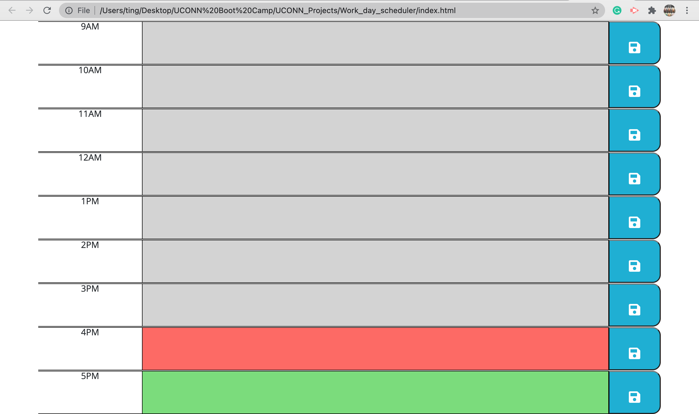
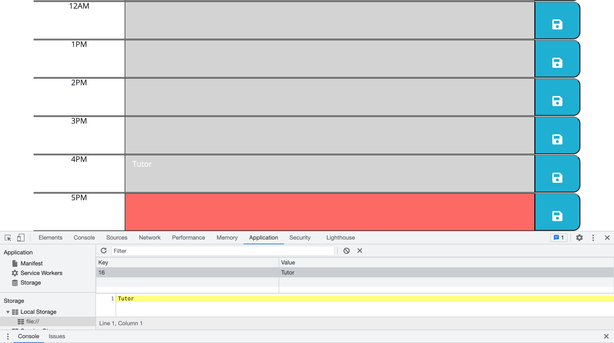

# Work_day_scheduler

The fifth weekly challenge of the boot camp.

## INFORMATION:

1. [assets] folder contains the [js] folder, the [css] folder, and the [screenshots] folder.
2. [js] folder contains the script.js.
3. [css] folder contains the CSS file.
4. [screenshots] folder contains the screenshots of the website for submission.

## Purpose:

A daily schedule tracker.

## Built With

- HTML
- CSS
- JAVASCRIPT

## Website

https://ting-hu.github.io/Work_day_scheduler/

## Contribution

Build by Xueting Hu

## Screenshots

